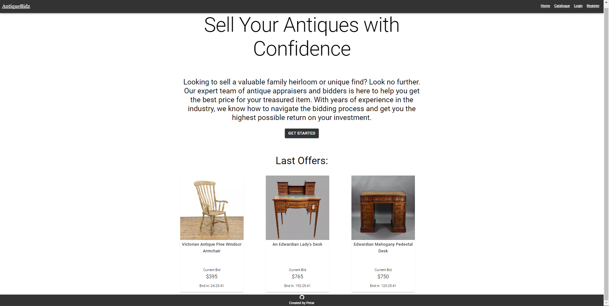
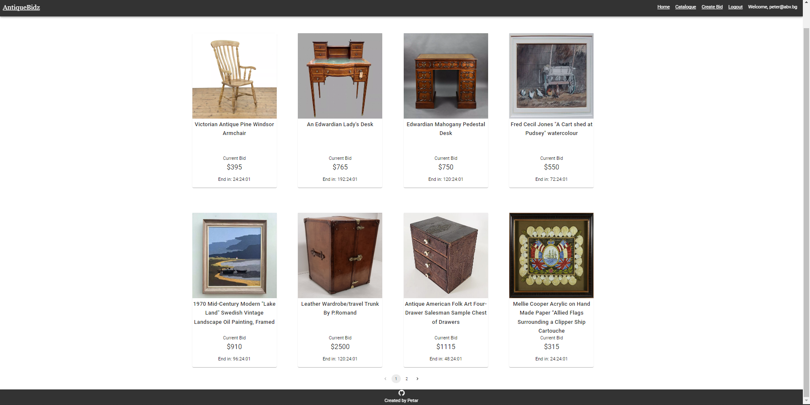
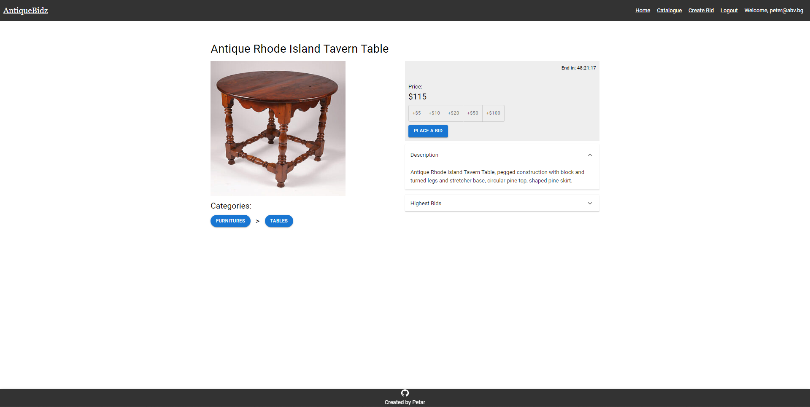
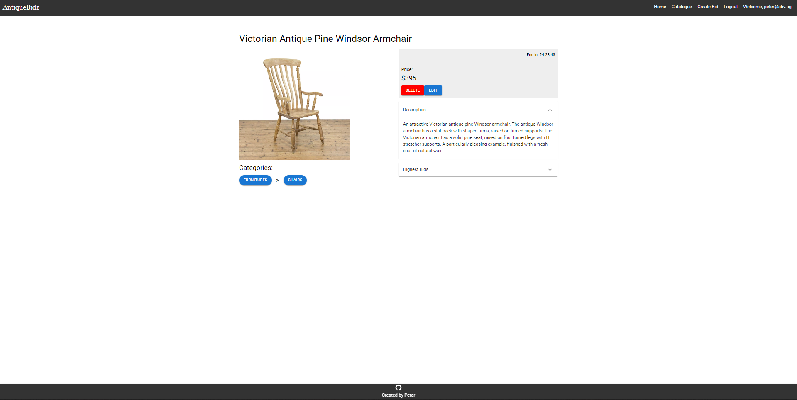
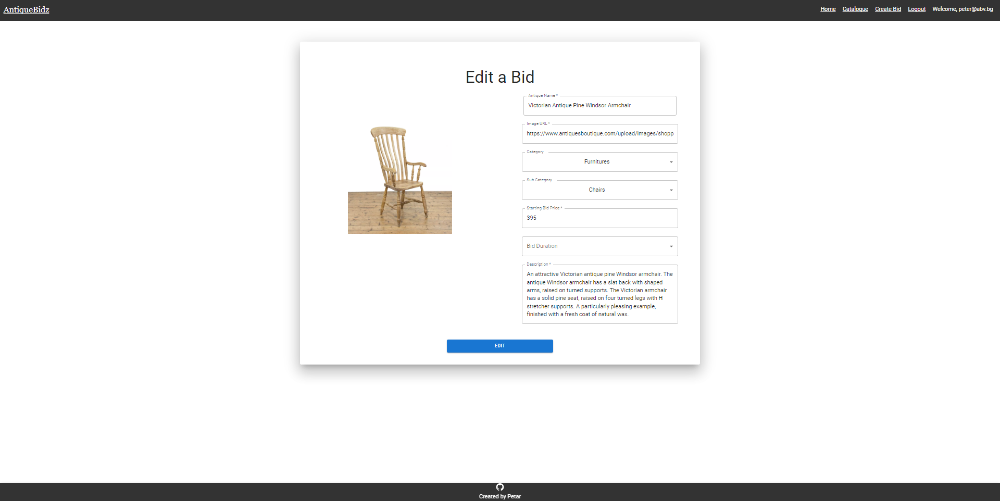

# Introduction
Antiquebids is a website developed using React for the SoftUni course defense (09.April.2023). The platform allows users to place bids or create their own bids.
## Deployment
The application is deployed on [https://antiquebidz.web.app](https://antiquebidz.web.app). Keep in mind that the server are still required in order to fetch the data. See the installation guide. The app will be migrated to firebase data in the near future.

## Installation
```bash
$git clone https://github.com/PetarPanajotov/antique-bidz.git
```
To clone the whole project.
### `npm install`
To install all required dependencies in order to run the project.
### `npm start`
Open [http://localhost:3000](http://localhost:3000) to view it in your browser.
### `cd server`
Redirects you to the server directory.
### `node server.js`
To start the server on [http://localhost:3030](http://localhost:3030)


## Authentication
To login, you can use one of the following pre-register accounts:
- email: peter@abv.bg password: 123456
- email: george@abv.bg password: 123456
- email: admin@abv.bg password: admin

Or just make an account with your email, first name, last name, password. The server will login you automatically.
## Navigation
Navigation changes based on if you are logged user or guest.
 
Users can access and see:
- Home
- Catalogue
- Details
- Create bid
- Logout

Guests can access and see:
- Home
- Catalogue
- Details
- Login
- Register

## Database
SoftUni practice server -  [https://github.com/softuni-practice-server/softuni-practice-server#usage](https://github.com/softuni-practice-server/softuni-practice-server#usage)

## Functionality
Users can access the following functionality:
- Create a bid
- Place a bid

If the following user is an owner of the viewed bid details, he also can:

- Delete a bid
- Edit a bid

Owner of the following antique cannot bid! The bid system is only for users who are not owner of the material.

Note that changes to the data will not be persisted! All operations happen in memory and will be wiped when the service is restarted.

## Used technologies
- HTML
- CSS
- Material UI
- React
- node.js

## Disclaimer
The resources used in this site are intended solely for educational purposes. The resources are not owned or created by the app developer and are used with permission or in accordance with fair use guidelines. The accuracy, reliability, and legal rights of the images provided are not guaranteed. Any reliance on the resources presented in this app is at the user's own risk.

## Screenshots
Home page for not logged in users:


Home page for logged in users:


Catalogue page:


Details page for logged in users and owners of the antique:


Details page for logged in users but not owners of the antique:


Edit page for only logged in users and owner of the antique:


## License

[MIT](https://choosealicense.com/licenses/mit/)
